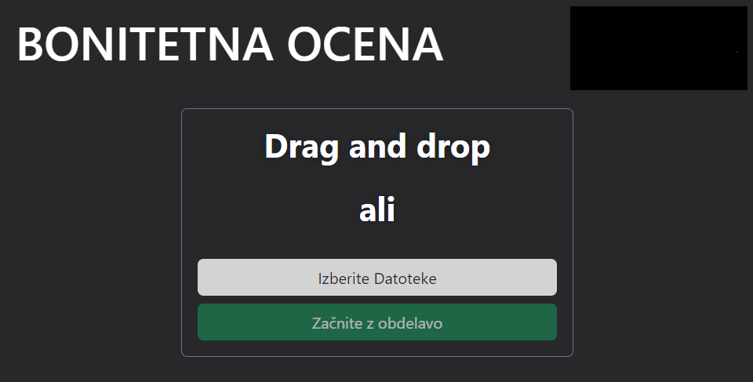
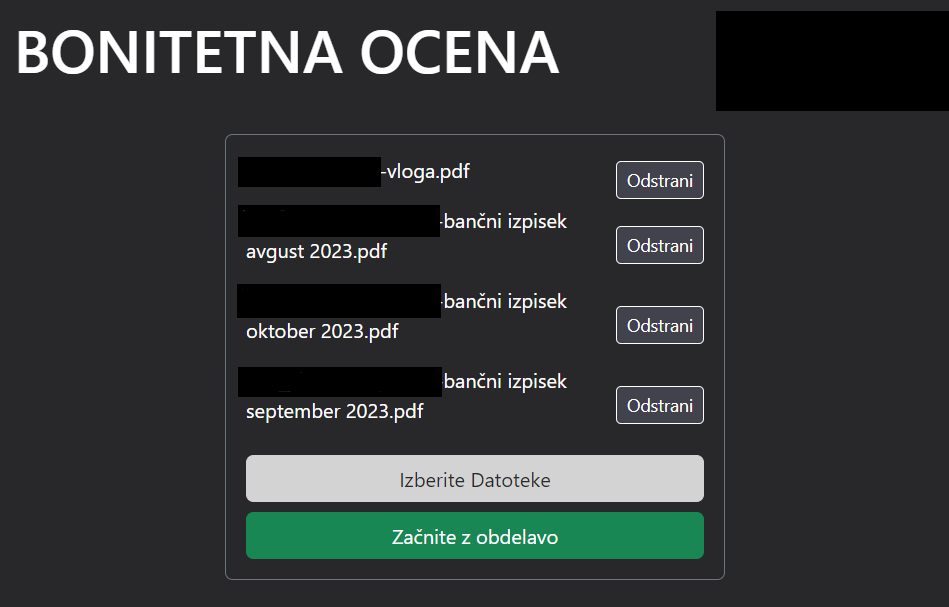

<a id="top"></a>
# Ocenjevanje bonitetne ocene – potrošniški krediti 
<div align="center">
  <h3>🌟 Aplikacija za avtomatizirano ocenjevanje bonitetne ocene za kreditna posojila 🌟</h3>
</div>

<p align="center">
  <a href="#opis">Opis</a> •
  <a href="#tehnologije">Tehnologije</a> •
  <a href="#inštalacije">Inštalacija</a> •
  <a href="#pogon">Pogon</a> •
  <a href="#avtorji">Avtorji</a>
</p>


## Opis

Informacijska rešitev ocenjuje bonitetno oceno na podlagi, PDF dokumentov o finančih izpiskih in osebnih podatkov. Z analizo teh vhodnih podatkov aplikacija določi primerno vrsto kredita in stopnjo tveganja za potencialne kreditojemalce, kar zagotavlja nemoten in ozaveščen postopek odobravanja kreditov. 

### Potek delovanja aplikacije

---
**[1] Ob zagonu aplikacije se pojavi vnosno polje za PDF dokumente.** 
<br>

---

**[2] Nato napolnimo vnosno polje z željenimi PDF dokumenti in pritisnemo na gumb "Začnite z obdelavo".** <br>
***Povezava za testne dokumente: https://teams.microsoft.com/l/message/19:8f1cfb9b2cc64560866ab2c0e0407ada@thread.tacv2/1717968291287?tenantId=8ef1464e-28b6-449d-95be-e669ee3d08ac&groupId=15b74a76-ed34-48c2-9175-2a97b19c58d2&parentMessageId=1717968291287&teamName=IPT-PR2-2023-24&channelName=PotrosniskiKrediti&createdTime=1717968291287&ngc=true*** <br>
<br>

---

**[3] Avotmatasko polnjenje vnosnih polji.** <br>
<br>

---

**[4] Avotmatasko polnjenje vnosnih polji**. <br>
<br>

---

**[5] Polnjenje excelovih celic. in racunanje bonitetne ocene.** <br>
<br>

---

**[6] Izračun bonitetne ocene na podlagi danih podatkov.** <br>
<br>
*Pri ocenjevanju ocene so potrebni tudi vnosi s strani podjetja, ki nudi posojila/kredite.*

---
## Tehnologije

<ul>
<li> React</li>
<li> Bootstrap</li>
<li> TypeScript</li>
<li> HTML</li>
<li> CSS</li>
</ul>

## Inštalacije
1. Namestitev npm paketov.
```
npm install
```
1.1 Če pride do težav z uvažanjem, namestite še naslednje dodatne pakete:
```
npm i react-bootstrap
npm i electron
npm i xlsx
npm install pdfjs-dist@3.0.279 tesseract.js
npm i exceljs file-saver  
```
## Pogon

Po uspešni namestitvi zahtevanih paketov odprite projekt v svojem najljubšem razvojnem okolju (npr. VSC, WebStorm...). <br>
1.Kloniranje repositorja
```sh
git clone https://github.com/Valeri1234car/PRII.git
```
2.Poženite program v direktoriju `PRII\desktop-app\electron-app>` z ukazom
```
npm run dev
```
## Avtorji

Razvijalci projekta: <br>
Domen Drovenik  <br>
Lazar Čvorović <br>
Valeri Kamburov <br>
## 
[🔼 Nazaj na vrh](#top)
